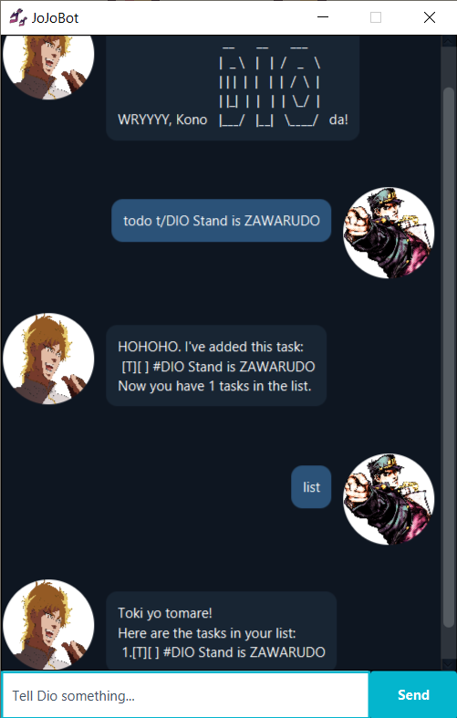

# JoJoBot User Guide
JoJoBot is a desktop app for **managing tasks, optimized for use via a Command Line Interface (CLI)** while still having 
the benefits of a Graphical User Interface (GUI). If you can type fast, JoJoBot can get your contact management tasks 
done faster than traditional GUI apps.

* [Quick start](#quick-start)
* [Features](#features)
  * [Listing all tasks: `list`](#listing-all-tasks-list)
  * [Adding a todo task: `todo`](#adding-a-todo-task-todo)
  * [Adding an event task: `event`](#adding-an-event-task-event)
  * [Adding a deadline task: `deadline`](#adding-a-deadline-task-deadline)
  * [Marking a task as done: `done`](#marking-a-task-as-done-done)
  * [Deleting a task: `delete`](#deleting-a-task-delete)
  * [Finding task(s) by keyword: `find`](#finding-tasks-by-keyword-find)
  * [Tagging a task: `tag`](#tagging-a-task-tag)
  * [Exiting the program: `bye`](#exiting-the-program-bye)
* [FAQ](#faq)
* [Command summary](#command-summary)

---
##  Quick start
1. Ensure you have Java `11` or above installed in your Computer.

2. Download the latest `jojobot.jar` from here.

3. Copy the file to the folder you want to use as the home folder for your JoJoBot.

4. Double-click the file to start the app. The GUI similar to the below should appear in a few seconds. 
Note how the app contains some sample data.

    

5. Type the command in the command box and press Enter to execute it. e.g. typing help and pressing Enter will open the help window.
Some example commands you can try:

    * `list` : Lists all contacts.

    * `event Beat Dio /at 2021-09-14`: Adds an event `Beat Dio` to the JoJoBot.

    * `delete 3` : Deletes the 3rd task shown in the current list.

    * `bye` : Exits the app.

Refer to the [Features](#features) below for details of each command.

---

## Features

>ℹ️ **Notes about the command format:**
>* Words in `UPPER_CASE` are the parameters to be supplied by the user.\
>e.g. in `todo n/TASK_DESCRIPTION`, `TASK_DESCRIPTION` is a parameter which can be used as `todo Use stand`.
>
>* Items in square brackets are optional.\
>e.g `TASK_DESCRIPTION [t/TAG]` can be used as `Use stand t/JoJo` or as `Use stand`.
>
>* Parameters cannot be in any order. Please follow the command formats below closely.\
>
>* Extraneous parameters for commands that do not take in parameters (such as list and bye) will be 
deemed as unknown command.\
>e.g. if the command specifies `list 123`, it will be unrecognizable by JoJoBot.

###  Listing all tasks: `list`

Shows a list of all tasks in the task list.

Format: `list`

###  Adding a todo task: `todo` 

Adds a Todo task, with the given task description, to the task list.

Format: `todo TASK_DESCRIPTION`

Examples:

* `todo read book`

###  Adding an event task: `event` 
Adds an Event task, with the given task description and date, to the task list.

Format: `event TASK_DESCRIPTION /at AT`

The `AT` must be in **YYYY-MM-DD** format.

Examples:
* `event go party /at midnight`
* `event attend wedding /at 2021-08-31`

###  Adding a deadline task: `deadline` 
Adds a Deadline task, with the given task description and date, to the task list.

Format: `deadline TASK_DESCRIPTION /by BY`

The `BY` must be in **YYYY-MM-DD** format.

Example:
* `deadline submit assignment /by 2021-09-16`

###  Marking a task as done: `done` 
Marks the task with the given index in the task list as done.

Format: `done INDEX`

The `INDEX` refers to the index number shown in the task list.\
The `INDEX` must be a **positive integer 1, 2, 3,…**\
The `INDEX` must be **in the range of number of existing task in the list.**

Examples:
* `done 2` marks 2nd task in the list as done.

###  Deleting a task: `delete` 
Deletes the task with the given index from the task list.

Format: `delete INDEX`

The `INDEX` refers to the index number shown in the task list.\
The `INDEX` must be a **positive integer 1, 2, 3,…**\
The `INDEX` must be **in the range of number of existing task in the list.**

Examples:
* `delete 2` deletes 2nd task in the list

Finding task(s) by keyword: find
Finds task(s) which contain(s) the given keyword.

### Finding task(s) by keyword:  `find` 
The search is **case-sensitive** e.g. `read` will **NOT** match `Read`.

Format: `find KEYWORD`

* Only the first given keyword is searched.\
e.g. `find read book` will only find task(s) which contain(s) the keyword `read`.
* **Only** description is searched.\
e.g. `find book` will only show tasks with the description containing keyword `book`.
* Partial words will be matched.\
e.g. `re` will match `read` and `lecture`.

### Tagging a task: `[t/TAG]`
Tags a specific task with tag when added. It is optional. It can neither be edited nor removed afterwards.

e.g. 
1. `todo t/DIO Stand is ZAWARUDO` adds a todo with tag `DIO`
2. `event t/JOTARO Stand is Star Platinum /at 2021-09-14` adds an event with tag `JOTARO`
3. `deadline t/JOSEPH Stand is Hermit Purple /by 2021-09-14` adds a deadline with tag `JOSEPH`

### Exiting the program: `bye`
Exits the program after 2 seconds of entering the command.

Format: exit

## FAQ
**Q:** How do I transfer my data to another Computer?\
**A:** Install the app in the other computer and overwrite the empty data file it creates with the file that contains the 
data of your previous AddressBook home folder.

## Command Summary
**Action** | **Format *e.g.* Examples**
------------ | -------------
**LIST** | `list`
**TODO** | `todo TASK_DESCRIPTION`  e.g.`todo read book`
**EVENT**| `event TASK_DESCRIPTION /at AT`  e.g.  `event go party /at midnight` or `event attend wedding /at 2021-08-31`
**DEADLINE**| `deadline TASK_DESCRIPTION /by BY`  e.g. `deadline submit assignment /by 2021-09-16`
**DONE**| `done INDEX`  e.g. `done 2` marks 2nd task in the list as done.
**DELETE**| `delete INDEX`  e.g. `delete 2` deletes 2nd task in the list
**FIND**| `find KEYWORD`  e.g. `find read book``
**TAG**| `[t/TAG]`  e.g. `todo t/DIO Stand is ZAWARUDO` or `event t/JOTARO Stand is Star Platinum /at 2021-09-14` or `deadline t/JOSEPH Stand is Hermit Purple /by 2021-09-14`
**EXIT**| `bye`
